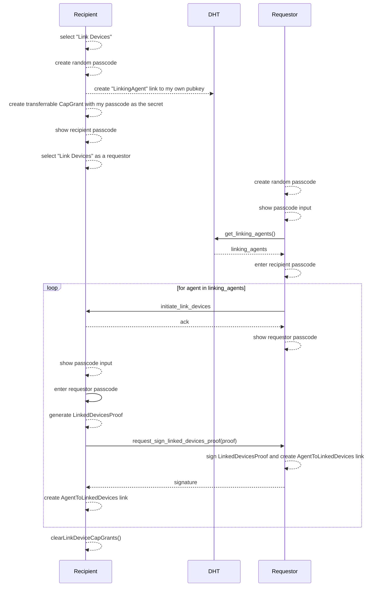

# Link Devices process

```mermaid
sequenceDiagram

Recipient-->>Recipient: select "Link Devices"

Recipient-->>Recipient: create random passcode
Recipient-->>DHT: create "LinkingAgent" link to my own pubkey
Recipient-->>Recipient: create transferrable CapGrant with my passcode as the secret
Recipient-->>Recipient: show recipient passcode

Recipient-->>Recipient: select "Link Devices" as a requestor
Requestor-->>Requestor: create random passcode
Requestor-->>Requestor: show passcode input

Requestor->>DHT: get_linking_agents()
DHT-->>Requestor: linking_agents

Requestor-->>Requestor: enter recipient passcode

loop for agent in linking_agents
  Requestor->>Recipient: initiate_link_devices
  Recipient-->>Requestor: ack
  Requestor-->>Requestor: show requestor passcode 

  Recipient-->>Recipient: show passcode input
  Recipient->>Recipient: enter requestor passcode

  Recipient-->>Recipient: generate LinkedDevicesProof
  Recipient->>Requestor: request_sign_linked_devices_proof(proof)
  Requestor-->>Requestor: sign LinkedDevicesProof and create AgentToLinkedDevices link
  Requestor-->>Recipient: signature
  Recipient-->>Recipient: create AgentToLinkedDevices link
end

Recipient-->>Recipient: clearLinkDeviceCapGrants()
```
